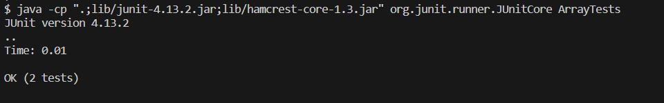

# Debugging Scenario

## Question

**Can't Run Tests**

**Category:** Debugging

**What environment are you using (computer, operating system, web browser, terminal/editor, and so on)?**

Computer: ROG STRIX

OS: Windows 11

Program: Visual Studio Code

Terminal: Bash

**Detail the symptom you're seeing. Be specific; include both what you're seeing and what you expected to see instead.
Screenshots are great, copy-pasted terminal output is also great. Avoid saying “it doesn't work”.**

I expected for my tests to run, I have two tests in ArrayTests.java but the output says only one runs and I'm not sure why.

**Detail the failure-inducing input and context. That might mean any or all of the command you're running, a test case, command-line arguments, working directory, even the last few commands you ran. Do your best to provide as much context as you can.**

The terminal says that is is caused by multiple things such as; ClassNotFoundException, BuiltInClassLoader, etc. My class is correctly spelled in the command and my tests seem to be correct:

## Response
Interesting! You notice the errors and I agree that your class is spelled correctly in the command. The issue lies in the format of your java command. 
Take a look at the commands here: 

Do you notice anything different about what you have and what is there?

## What Happened? 
When you look at the code in the link provided you may have noticed that your issue was simply adding .java at the end of your java command. 

The javac command requires the .java part of files
But the java command does not. This can often be forgotten or overlooked and that's when panic may occur.

## Reconstructing the Bug
For this specific example, the lab3 repository was used, but this issue can happen in any code that you try to compile. 
Here there was 7 .java files within the lab3-main folder. 
Since this issue was in the terminal, to cause it you just need to correctly run the javac command:
> in this case `javac -cp ".;lib/hamcrest-core-1.3.jar;lib/junit-4.13.2.jar" *.java`

Then run the java command but with .java at the end of the class you are calling.
> like this: `java -cp ".;lib/junit-4.13.2.jar;lib/hamcrest-core-1.3.jar" org.junit.runner.JUnitCore ArrayTests.java`

# Reflection 

